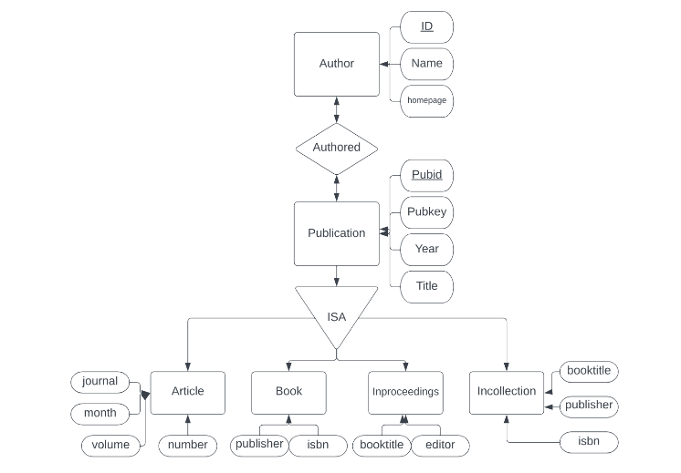
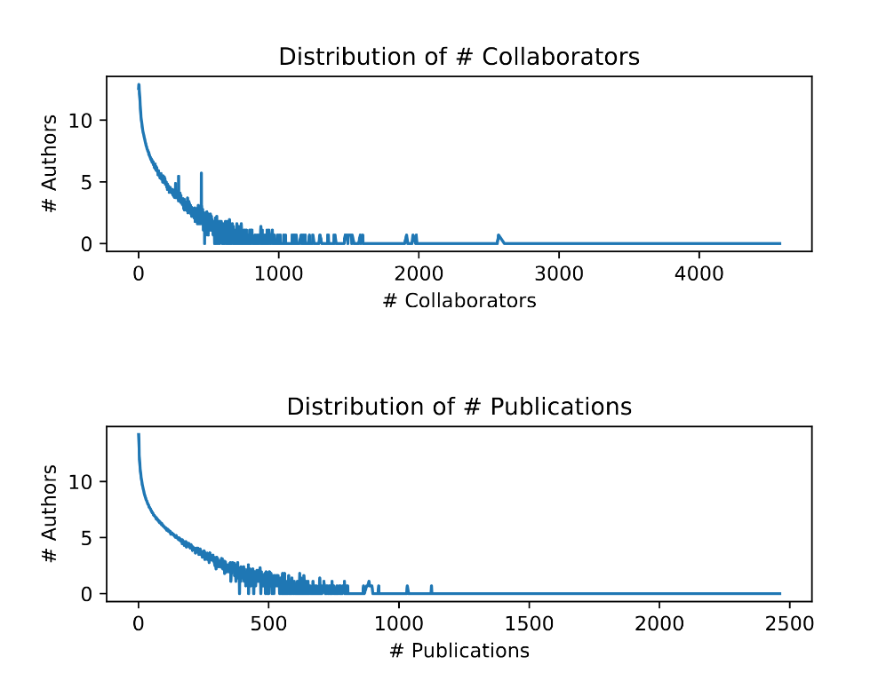

## Revelant Info

 
- Displays the E/R Diagram for this projects' Schema. Identifies all keys in all entity sets, and indicates the correct type of all relationships (many-many or many-one).

### Objectives: To get familiar with the main components of the data analytic pipeline: schema design, data acquisition, data transformation, and querying.

Files: wrapper.py  Download wrapper.py, dblp.dtd,  Download dblp.dtd,createRawSchema.sql Download createRawSchema.sql

Google Drive (output files from wrapper.py): https://drive.google.com/drive/folders/1Jd8yLNdnyJgYMqOcILZLDTaQ5XGwOtlw?usp=sharing (Links to an external site.)

Assignment tools: postgres, excel (or some other tool for visualization)

What to turn in: These files: pubER.pdf, createPubSchema.sql, importPubData.sql, solution.sql, graph.py, graph.pdf. Your solution.sql file should be executable using the command psql -f solution.sql

### Motivation: implement a data analysis pipeline: data acquisition, transformation and extraction, cleaning, analysis and sharing of results. The data is DBLP (Links to an external site.), the reference citation website created and maintained by Michael Ley. 

### Resources:

#### postgres, MYSQL, or SQLLite

starter code

Problem 1: Conceptual Design
Design and create a database schema about publications. We will refer to this schema as PubSchema, and to the data as PubData.

E/R Diagram. Design the E/R diagram, consisting of the entity sets and relationships below. Draw the E/R diagram for this schema, identify all keys in all entity sets, and indicate the correct type of all relationships (many-many or many-one); make sure you use the ISA box where needed.
Author has attributes: id (a key; must be unique), name, and homepage (a URL)
Publication has attributes: pubid (the key -- an integer), pubkey (an alternative key, text; must be unique), title, and year. It has the following subclasses:
Article has additional attributes: journal, month, volume, number
Book has additional attributes: publisher, isbn
Incollection has additional attributes: booktitle, publisher, isbn
Inproceedings has additional attributes: booktitle, editor
There is a many-many relationship Authored from Author to Publication
Turn in the file pubER.pdf  which will contain the ER diagram 

Problem 2: Schema Design
Here you will create the SQL tables in a database like postgres, MYSQL, or SQLLite. First, check that you have installed postgres (or another db) on your computer. Then, create an empty database by running the following commands (sample commands for postgres):

$ createdb dblp
If you need to restart, then delete it by running:

$ dropdb dblp
To run queries in postgres, type:

$ psql dblp
then type in your SQL commands. Remember three special commands:

\q -- quit psql
\h -- help
\? -- help for meta commands
Next, design the SQL tables that implement your conceptual schema (the E/R diagram). We will call this database schema the PubSchema. Write create Table SQL statements, e.g.:

create Table Author (...);
...
Choose int and text for all data types. Create keys, foreign keys, and unique constraints, as needed; you may either do it within CREATE TABLE, or postpone this for later and use ALTER TABLE. 

Write all your commands in a file called createPubSchema.sql. You can execute them in two ways. Start postgres interactively and copy/paste your commands one by one. Or, from the command line run:

psql -f createPubSchema.sql dblp
Hint: for debugging purposes, insert drop Table commands at the beginning of the createPubSchema.sql file:

drop table if exists Author;
...
Turn in the file createPubSchema.sql which contains all you create table statements. 

Problem 3: Data Acquisition
Typically, this step consists of downloading data, or extracting it with a software tool, or inputting it manually, or all of the above. Then it involves writing and running some python script, called a wrapper that reformats the data into some CSV format that we can upload to the database.

Download the DBLP data dblp.dtd  Download dblp.dtdand dblp.xml.gz from the dblp website (Links to an external site.), then unzip the xml file. Make sure you understand what data the the big xml file contains: look inside by running:

more dblp.xml
If needed, edit the wrapper.py  Download wrapper.pyand update the correct location of dblp.xml and the output files pubFile.txt and fieldFile.txt, then run:

python wrapper.py
This will take several minutes, and produces two large files: pubFile.txt and fieldFile.txt. Before you proceed, make sure you understand what happened during this step, by looking inside these two files: they are tab-separated files, ready to be imported in postgres.

Next, edit the file createRawSchema.sql in the starter code to point to the correct path of pubFile.txt and fieldFile.txt: they must be absolute paths, e.g. /home/myname/pubFile.txt. Then run:

psql -f createRawSchema.sql dblp
This creates two tables, Pub and Field, then imports the data (which may take a few minutes). We will call these two tables RawSchema and RawData respectively.

Problem 4: Querying the Raw Data
During typical data ingestion, you sometimes need to discover the true schema of the data, and for that you need to query the RawData.

Start psql then type the following commands:

select * from Pub limit 50;
select * from Field limit 50;
For example, go to the dblp website (Links to an external site.), check out this paper, search for Henry M. Levy, look for the "Vanish" paper, and export the entry in BibTeX format. You should see the following in your browser

@inproceedings{DBLP:conf/uss/GeambasuKLL09,
  author    = {Roxana Geambasu and
               Tadayoshi Kohno and
               Amit A. Levy and
               Henry M. Levy},
  title     = {Vanish: Increasing Data Privacy with Self-Destructing Data},
  booktitle = {18th {USENIX} Security Symposium, Montreal, Canada, August 10-14,
               2009, Proceedings},
  pages     = {299--316},
  year      = {2009},
  crossref  = {DBLP:conf/uss/2009},
  url       = {http://www.usenix.org/events/sec09/tech/full_papers/geambasu.pdf},
  timestamp = {Thu, 15 May 2014 18:36:21 +0200},
  biburl    = {http://dblp.org/rec/bib/conf/uss/GeambasuKLL09},
  bibsource = {dblp computer science bibliography, http://dblp.org}
}
The key of this entry is conf/uss/GeambasuKLL09. Try using this info by running this SQL query:

select * from Pub p, Field f where p.k='conf/uss/GeambasuKLL09' and f.k='conf/uss/GeambasuKLL09'
Write SQL Queries to answer the following questions using RawSchema:

For each type of publication, count the total number of publications of that type. Your query should return a set of (publication-type, count) pairs. For example (article, 20000), (inproceedings, 30000), ... (not the real answer).

We say that a field occurs in a publication type, if there exists at least one publication of that type having that field. For example, publisher occurs in incollection, but publisher does not occur in inproceedings. Find the fields that occur in all publications types. Your query should return a set of field names: for example it may return title, if title occurs in all publication types (article, inproceedings, etc. notice that title does not have to occur in every publication instance, only in some instance of every type), but it should not return publisher (since the latter does not occur in any publication of type inproceedings).

Your two queries above may be slow. Speed them up by creating appropriate indexes, using the CREATE INDEX statement. You also need indexes on Pub and Field for the next question; create all indices you need on RawSchema

Turn in a file solution.sql consisting of SQL queries and all their answers inserted as comments

Problem 5: Data Transformation.
Next, you will transform the DBLP data from RawSchema to PubSchema. This step is sometimes done using an ETL tool, but we will just use several SQL queries. You need to write queries to populate the tables in PubSchema. For example, to populate Article, you will likely run a SQL query like this:

insert into Article (select ... from Pub, Field ... where ...);
The RawSchema and PubSchema are quite different, so you will need to go through some trial and error to get the transformation right. Here are a few hints (but your approach may vary):

create temporary tables (and indices) to speedup the data transformation. Remember to drop all your temp tables when you are done

it is very inefficient to bulk insert into a table that contains a key and/or foreign keys (why?); to speed up, you may drop the key/foreign key constraints, perform the bulk insertion, then alter Table to create the constraints.

PubSchema requires an integer key for each author and each publication. Use a sequence in postgres. For example, try this and see what happens:

create table R(a text);
insert into R values ('a');
insert into R values ('b');
insert into R values ('c');
create table S(id int, a text);
create sequence q;
insert into S (select nextval('q') as id, a from R);
drop sequence q;
select * from S;
DBLP knows the Homepage of some authors, and you need to store these in the Author table. But where do you find homepages in RawData? DBLP uses a hack. Some publications of type www are not publications, but instead represent homepages. To find 'Henry M. Levy' homepage, run the following query (this should run very fast, 1 second or less, if you created the right indices):
select z.* from Pub x, Field y, Field z where x.k=y.k and y.k=z.k and x.p='www' and y.p='author' and y.v='Henry M. Levy';
Get it? Now you know Levy's homepage. However, you are not there yet. Some www entries are not homepages, but are real publications. Try this:

select z.* from Pub x, Field y, Field z where x.k=y.k and y.k=z.k and x.p='www' and y.p='author' and y.v='Dan Suciu'
Your challenge is to find out how to identify each author's correct Homepage. (A small number of authors have two correct, but distinct homepages; you may choose any of them to insert in Author)

What if a publication in RawData has two titles? Or two publishers? Or two years? (You will encounter duplicate fields, but not necessarily these ones.) You may pick any of them, but you need to work a little to write this in SQL.
Turn in the file importPubData.sql containing several insert, create Table, alter Table, etc statements.

Problem 6: Run Data Analytic Queries
Finally, you reached the fun part. Write SQL queries to answer the following questions:

Find the top 20 authors with the largest number of publications. (Runtime: under 10s)

Find the top 20 authors with the largest number of publications in STOC. Repeat this for two more conferences, of your choice. Suggestions: top 20 authors in SOSP, or CHI, or SIGMOD, or SIGGRAPH; note that you need to do some digging to find out how DBLP spells the name of your conference. (Runtime: under 10s.)

The two major database conferences are 'PODS' (theory) and 'SIGMOD Conference' (systems). Find

(a). all authors who published at least 10 SIGMOD papers but never published a PODS paper, and
(b). all authors who published at least 5 PODS papers but never published a SIGMOD paper. (Runtime: under 10s)
A decade is a sequence of ten consecutive years, e.g. 1982, 1983, ..., 1991. For each decade, compute the total number of publications in DBLP in that decade. Hint: for this and the next query you may want to compute a temporary table with all distinct years. (Runtime: under 1minute.)

Find the top 20 most collaborative authors. That is, for each author determine its number of collaborators, then find the top 20. Hint: for this and some question below you may want to compute a temporary table of coauthors. (Runtime: a couple of minutes.)

For each decade, find the most prolific author in that decade. Hint: you may want to first compute a temporary table, storing for each decade and each author the number of publications of that author in that decade. Runtime: a few minutes.

Find the institutions that have published most papers in STOC; return the top 20 institutions. Then repeat this query with your favorite conference (SOSP or CHI, or ...), and see which are the best places and you didn't know about. Hint: where do you get information about institutions? Use the Homepage information: convert a Homepage like http://www.cs.ucr.edu/msalloum to http://www.cs.ucr.edu; now you have grouped all authors from our department, and we use this URL as surrogate for the institution. Read about substring manipulation in postres, by looking up substring, position, and trim.

Turn in SQL queries in the file called solution.sql.

Problem 7: Data Visualization.
Here you are asked to create some histograms (graphs), by writing a python script that first runs a query, then produces a graph using the result of the query.

Construct two histograms: the histogram of the number of collaborators, and the histogram of the number of publications. The first histograph will have these axes:

the X axis is a number X=1,2,3,...
the Y axis represents the number of authors with X collaborators: Y(0)= number of authors with 0 collaborators, Y(1) = number of authors with 1 collaborator, etc
Similarly for the second histogram. Try using a log scale, or a log-log scale, and choose the most appropriate. Feel free to produce a very nice graph (not necessarily a histogram).

Resources:

Accessing postgres from python tutorial (Links to an external site.); see also pythonpsql.py in the starter code
Plotpy library (Links to an external site.)
Turn in a file graph.py and the output it generated in a file graph.pdf

Submitting your assignment
You may submit your code multiple times; we will use the latest version you submit that arrives before the deadline. Put all your files(pubER.pdf, createPubSchema.sql, solution.sql, importPubData.sql, graph.py, graph.pdf) in a zipfile and upload to Canvas.
